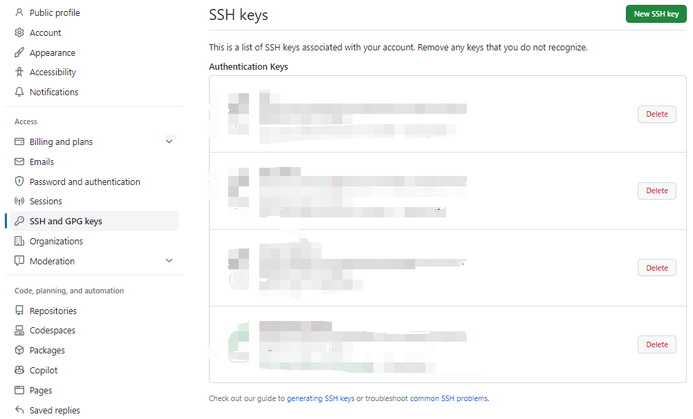

- [1 初级（ubuntu20.04）](#1-初级ubuntu2004)
  - [1.1 安装git](#11-安装git)
    - [（1）使用APT安装](#1使用apt安装)
    - [（2）配置姓名和邮件](#2配置姓名和邮件)
    - [（3）配置文件被存储在~/.gitconfig文件](#3配置文件被存储在gitconfig文件)
    - [（4）参考](#4参考)
      - [如何在 Ubuntu 20.04 上安装 Git](#如何在-ubuntu-2004-上安装-git)
  - [1.2 生成SSH密钥](#12-生成ssh密钥)
    - [（1）本地生成SSH密钥，一对公/私钥](#1本地生成ssh密钥一对公私钥)
    - [（2）将公钥id\_rsa.pub内容拷贝到github服务器](#2将公钥id_rsapub内容拷贝到github服务器)
  - [1.3 将本地项目上传到github（需完成1.2）](#13-将本地项目上传到github需完成12)
    - [（1）首次上传](#1首次上传)
      - [创建远程仓库](#创建远程仓库)
      - [初始化本地仓，将工作的变化添加到暂存区，创建提交，push到远程仓库](#初始化本地仓将工作的变化添加到暂存区创建提交push到远程仓库)
    - [（2）后续上传](#2后续上传)
  - [1.4 git设置HTTP(S)代理（SHH协议无需设置）](#14-git设置https代理shh协议无需设置)
    - [（1）设置代理](#1设置代理)
    - [（2）查看代理](#2查看代理)
    - [（3）取消代理](#3取消代理)
    - [（4）参考](#4参考-1)
      - [git设置、查看、取消代理](#git设置查看取消代理)
  - [1.5 解决Github连接慢或者无法连接(通过修改hosts文件解决)](#15-解决github连接慢或者无法连接通过修改hosts文件解决)
  - [1.6 常用git命令](#16-常用git命令)
- [2 进阶](#2-进阶)
  - [2.1 工作区、暂存区、本地仓库，远程仓库](#21-工作区暂存区本地仓库远程仓库)
    - [（1）工作区](#1工作区)
    - [（2）暂存区](#2暂存区)
    - [（3）本地仓库](#3本地仓库)
    - [（4）远程仓库](#4远程仓库)
  - [2.2 git stash](#22-git-stash)
    - [（1）介绍](#1介绍)
    - [（2）用法](#2用法)
  - [2.3 git reset](#23-git-reset)
    - [（1）介绍](#1介绍-1)
    - [（2）用法](#2用法-1)
  - [2.4 git revert](#24-git-revert)
    - [（1）介绍](#1介绍-2)
    - [（2）用法](#2用法-2)
  - [2.5 git log](#25-git-log)
  - [2.6 git status](#26-git-status)
  - [2.7 git rm](#27-git-rm)
    - [（1）介绍](#1介绍-3)
    - [（2）用法](#2用法-3)
    - [（3）示例](#3示例)
  - [2.8 .gitignore](#28-gitignore)
    - [（1）介绍](#1介绍-4)
    - [（2）用法](#2用法-4)
      - [忽略指定的文件或文件类型](#忽略指定的文件或文件类型)
      - [使用通配符和模式匹配](#使用通配符和模式匹配)
      - [反选（取消忽略）](#反选取消忽略)
      - [使用注释](#使用注释)

# 1 初级（ubuntu20.04）
## 1.1 安装git
### （1）使用APT安装
    sudo apt update         // 更新apt
    sudo apt install git    // 安装git
    git --version           // 查看git版本，当前是 git version 2.25.1
### （2）配置姓名和邮件
    git config --global user.name  "Your Name"                  
    git config --global user.email "youremail@yourdomain.com"
                                

### （3）配置文件被存储在~/.gitconfig文件
    [user]
        name = Your Name
        email = youremail@yourdomain.com
### （4）参考 
#### [如何在 Ubuntu 20.04 上安装 Git](https://zhuanlan.zhihu.com/p/137578868)
 

## 1.2 生成SSH密钥
### （1）本地生成SSH密钥，一对公/私钥
    先检查~/.ssh目录下有无 id_rsa（私钥）和id_rsa.pub（公钥）
    若已存在，则不需要生成，防止覆盖；若无，则使用下面的命令生成：
    ssh-keygen -t rsa       // 在~/.ssh目录下生成密钥
### （2）将公钥id_rsa.pub内容拷贝到github服务器

 

## 1.3 将本地项目上传到github（需完成1.2）
### （1）首次上传
#### 创建远程仓库
    使用github网页版，new一个新的仓库。仓库有两个地址，分别对应两种协议：
    1. SSH协议：  git@github.com:apanda-xu/documents.git
    2. HTTPS协议：https://github.com/apanda-xu/documents.git
    推荐使用SSH协议，更稳定；HTTP/HTTPS协议容易被墙，不稳定
    
#### 初始化本地仓，将工作的变化添加到暂存区，创建提交，push到远程仓库
    cd {workspace}                                                // 进入项目所在的文件夹
    git init                                                      // 初始化项目文件夹作为本地仓库
    touch README.md                                               // 新建一个文件
    git add README.md                                             // 将文件添加到暂存区
    git commit -m "first commit"                                  // 创建一个提交
    git branch -M main                                            // 修改当前分支名为main
    git remote add origin git@github.com:apanda-xu/documents.git  // 连接远程仓库, 推荐使用SSH协议地址
    git push -u origin main                                       // push到远程仓库
### （2）后续上传
    git pull    // 由于第一次push使用了-u参数，所以后续上传可以简单push                
    git push
 

## 1.4 git设置HTTP(S)代理（SHH协议无需设置）
### （1）设置代理
    git config --global http.proxy 'socks5://127.0.0.1:1080' 
    git config --global https.proxy 'socks5://127.0.0.1:1080'
### （2）查看代理
    git config --global --get http.proxy
    git config --global --get https.proxy
### （3）取消代理
    git config --global --unset http.proxy
    git config --global --unset https.proxy
### （4）参考
#### [git设置、查看、取消代理](https://www.cnblogs.com/yongy1030/p/11699086.html)
 

## 1.5 [解决Github连接慢或者无法连接(通过修改hosts文件解决)](https://cloud.tencent.com/developer/article/2023920)
 

## 1.6 [常用git命令](./git_commands.md)

 
 

# 2 进阶
## 2.1 工作区、暂存区、本地仓库，远程仓库
git有三个重要的概念，分别是工作区，暂存区，仓库
### （1）工作区
    工作区是指你在电脑上能看到的目录，包含了项目的实际文件。
### （2）暂存区
    暂存区是一个中间区域，用于存放待提交的修改。在对文件进行修改后，你可以使用 git add 命令将修改的文件添加到暂存区。
### （3）本地仓库
    仓库是 Git 中用来存储项目历史记录的地方。它包含了项目的所有版本和分支信息。当你使用 git commit 命令提交暂存区的修改时，Git 会将这些修改保存到仓库中，生成一个新的提交记录。
### （4）远程仓库
    远程仓库是存储在网络上的一个共享仓库，它可以与多个开发者之间共享代码。当你在本地仓库进行了一些提交后，你可以使用 git push 命令将这些提交推送到远程仓库中，以便与其他开发者共享和同步代码。
## 2.2 git stash
### （1）介绍
    git stash 是一个用于临时保存和恢复工作目录状态的命令。它可以在你切换分支、修复 bug 或者执行其他任务之前，暂存当前的修改，以便你能够在之后恢复到这些修改。
### （2）用法
    git stash save "message"    // 将当前的修改暂存起来，并添加一个描述性的消息
    git stash list              // 显示当前保存的所有stash列表
    git stash apply stash@{n}   // 将指定的修改应用到当前分支，不删除stash
    git stash pop stash@{n}     // 将指定的修改应用到当前分支，并删除stash
    git stash drop stash@{n}    // 删除指定的stash，从stash列表中移除

## 2.3 git reset
### （1）介绍
    git reset命令用于修改当前分支的提交历史，或者将HEAD和当前分支的指针移动到特定的提交位置。它可以用于撤销提交、移动分支指针或者修改提交状态。
### （2）用法
    git reset commit_hash --soft    // 将HEAD移动到指定提交，该提交之后的工作区修改保留，暂存区修改保留，该提交之后的分支历史会被清除
    git reset commit_hash --mixed   // 默认选项，将HEAD移动到指定提交，该提交之后的工作区修改保留，暂存区修改不保留，该提交之后的分支历史会被清除
    git reset commit_hash --hard：  // 将HEAD移动到指定提交，该提交之后的工作区修改不保留，暂存区修改不保留，该提交之后的分支历史会被清除
    git reset HEAD file_name        // 将指定文件从暂存区中移除，但保留其在工作区中的修改
    git reset --merge               // 取消合并冲突，将当前分支回退到合并之前的状态
## 2.4 git revert
### （1）介绍
    git revert 是撤销某个提交的操作，并生成一个新的提交来表示该撤销操作。
    git revert 命令使用时，确保当前工作区是干净的，没有未提交的更改，否则需要使git stash暂存当前的更改
### （2）用法
    git revert <commit>             // 撤销指定的提交，被撤销提交的工作区和暂存区修改不保留，同时生成一个新的提交来记录此撤销
    git revert -n <commit>          // 撤销指定的提交，被撤销提交的工作区和暂存区修改不保留，但不生成一个新的提交来记录此撤销
    git revert <commit1>..<commit2> // 撤销commit1到commit2之间的提交，左开右闭，被撤销提交的工作区和暂存区修改不保留，同时生成多个新提交来记录这些撤销
    git revert HEAD                 // 撤销最新的提交，其中HEAD表示最新的提交，HEAD~或HEAD~1表示最新提交之前的一个提交，HEAD~2以此类推
## 2.5 git log
    git log                         // 完整显示提交历史
    git log --oneline               // 简洁显示提交历史
    git log <branch-name>           // 查看指定分支的提交历史
    git log <file-path>             // 查看指定文件的提交历史
    git log --author=<author-name>  // 查看指定作者的提交历史
## 2.6 git status
    git status 命令用于查看当前代码仓库的状态。它会显示当前分支的状态以及工作区和暂存区的文件状态。
## 2.7 git rm
### （1）介绍
    git rm 命令用于从 Git 仓库中移除文件。
### （2）用法
    git rm <file-path>              // 从工作区和仓库中同时删除文件 
    git rm --cached <file-path>     // 仅从仓库中删除文件，保留在工作区中
    git commit -m "Remove file"     // 在使用 git rm 命令后，记得要进行一次提交以将更改记录到 Git 仓库中
### （3）示例
    如果你希望从远程仓库中删除已经推送的文件，但保留在你的本地工作区中，可以按照以下步骤进行操作：

    1. git rm --cached <file-path>                          // 首先，使用 git rm 命令将文件从 Git 仓库中移除，并将其标记为待删除状态
    2. git commit -m "Remove file from remote repository"   // 提交更改
    3. git push origin <branch-name>                        // 推送更改到远程仓库
   
    通过执行以上步骤，你可以从远程仓库中删除文件，但仍然在你的本地工作区中保留该文件。其他团队成员在拉取更新时会将文件从远程仓库中删除。
## 2.8 .gitignore
### （1）介绍
    .gitignore 文件用于指定 Git 仓库中需要忽略的文件和目录。在 .gitignore 文件中列出的文件和目录将不会被 Git 追踪和包含在版本控制中。.gitignore 文件是一个文本文件，每一行表示一个需要忽略的模式规则。
### （2）用法
#### 忽略指定的文件或文件类型
    1. file.txt        // 忽略具体文件
    2. *.log           // 忽略所有以 .log 结尾的文件
    3. directory/      // 忽略整个目录
#### 使用通配符和模式匹配
    1. *.txt           // 忽略所有以 .txt 结尾的文件
    2. build/          // 忽略名为 build 的目录
    3. doc/*.pdf       // 忽略 doc 目录下的所有以 .pdf 结尾的文件
#### 反选（取消忽略）
    1. *.txt           // 忽略所有 .txt 文件
    2. !important.txt  // 反选特定的文件。和上面配合使用的结果：所有以 .txt 结尾的文件将被忽略，但 important.txt 文件将被反选，不再被忽略。
#### 使用注释
    *.log              // 忽略所有以 .log 结尾的文件